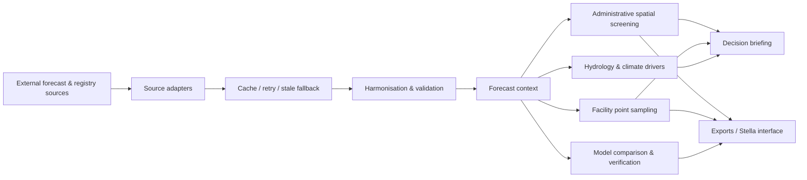

# REACH Climate–Health EWS · Architecture

## Purpose

The portal is designed as an end-to-end research decision-support workflow rather than a collection of disconnected charts. The interaction model is:

**Monitor → Locate → Compare → Act → Verify**

This keeps the scientific forecasting workflow connected to district/municipality screening, facility drill-down, uncertainty, decision support and retrospective verification.

## Layers

### 1. Source layer

- ECMWF IFS / ENS / EC46 / SEAS5
- NOAA GFS / GEFS / NMME and climate-driver products
- GloFAS river discharge guidance
- ERA5 historical/reference context
- Zambia administrative and health-facility geography
- Brazil municipality and CNES facility registry data
- Uploaded REACH HMIS / facility-context files

The portal keeps operational sources explicit and links back to them. National warning services remain authoritative.

### 2. Acquisition and resilience layer

`cached_json()` provides a shared request path for most forecast calls:

- deterministic cache key from URL + parameters
- live request with retries
- rate-limit handling
- local JSON cache
- stale-cache fallback when the live source is temporarily unavailable

This lets the public dashboard fail softly rather than losing the complete user workflow when one upstream service is unavailable.

### 3. Harmonisation layer

Source-specific data are translated to a consistent application vocabulary:

- country / state / district / municipality / facility
- forecast horizon
- valid period
- hazard
- physical vs probabilistic view
- units and thresholds
- source/status/provenance

The same selection context is then reused throughout the dashboard so the map, facility screen, time series, climate drivers, briefing and verification remain logically connected.

### 4. Forecast and analytical layer

The analytical layer supports:

- short range, medium range, sub-seasonal and seasonal outlooks
- heat, rainfall/flood, river discharge, dry anomaly and compound screens
- administrative-area screening
- facility-coordinate sampling
- labelled facility contour visualisation (visual interpolation only)
- ECMWF vs NOAA comparison
- ERA5 context and historical verification
- uncertainty and return-period calculations

### 5. Decision layer

Forecast information is translated into a decision narrative with:

- forecast window
- selected-area signal
- facility exposure context
- timing
- climate-driver and hydrological context
- uncertainty / evidence convergence
- health-system preparedness action

This layer is intentionally separate from official warning issuance.

### 6. Output layer

Outputs include:

- maps and interactive charts
- facility tables and comparison plots
- decision briefing text
- spatial and verification CSV exports
- Stella / system-dynamics integration outputs
- provenance and documentation

## Cascading interaction model

The primary selection path is:

**Country → state (Brazil only) → forecast horizon → hazard → valid period → map type → district/municipality → facility**

A change high in the hierarchy should cascade to every downstream element. A facility never becomes a peer of a district/municipality; it remains nested beneath its parent geography.

## Reliability rules

1. Do not expose raw technical tracebacks to end users.
2. Keep source and status visible near the result they support.
3. Preserve stale cached data only with an explicit stale status.
4. Do not convert a hazard/exposure signal into an operational facility-risk score unless readiness/access data are actually present.
5. Treat ERA5 as historical/reference context unless it is being used for a historical verification date.
6. Keep interpolated facility contour surfaces clearly labelled as visual interpolation rather than native model grids.
7. Keep official warnings distinct from this research decision-support portal.

## Future production hardening

For a production service beyond Streamlit-only deployment, the same architecture can be split into:

- **frontend:** Streamlit or a dedicated web client
- **API service:** FastAPI endpoints for geography, forecast, facility and verification products
- **worker layer:** scheduled acquisition / pre-computation jobs
- **cache:** Redis or object storage
- **persistent data:** Postgres/PostGIS for registry and derived spatial products
- **monitoring:** source health, request latency, cache freshness, failed jobs and deployment version

The current release deliberately retains a simpler deployment footprint while keeping these boundaries explicit in the code and documentation.
